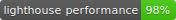
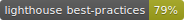
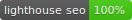
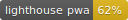

## Jekyll Starter Blog Template

[](https://app.codacy.com/app/sutanlab/jekyll-starter-blog?utm_source=github.com&utm_medium=referral&utm_content=sutanlab/jekyll-starter-blog&utm_campaign=Badge_Grade_Dashboard)
[](https://travis-ci.org/sutanlab/jekyll-starter-blog) [](https://sutanlab.js.org/jekyll-starter-blog) [](https://sutanlab.js.org/jekyll-starter-blog) [](https://sutanlab.js.org/jekyll-starter-blog) [](https://sutanlab.js.org/jekyll-starter-blog) [](https://sutanlab.js.org/jekyll-starter-blog) [](https://sutanlab.js.org/jekyll-starter-blog)

> Static generated site designed for developers that want to write blog posts that hosted in static hosting (e.g: [Github Pages](https://pages.github.com/)).

> Demo Website : https://sutanlab.js.org/jekyll-starter-blog

### Features
- Simple, automated and fast
- SEO Optimized
- Mobile friendly (Add to Home Screen)
- Comment System with Disqus
- Live Search
- AJAX Pagination
- Feed RSS
- Sitemap
- Robots Txt
- Shell script to create posts and automation deploy to github pages

### Required in System
1. [NodeJS](https://nodejs.org/en/download/) 
2. [Ruby](https://www.ruby-lang.org/en/downloads/) 

### Setup
1. Install the requirements
2. [Fork Jekyll Starter Blog](https://github.com/sutanlab/jekyll-starter-blog/fork)
3. Clone or download the repository you just forked
4. Go to folder you just cloned or downloaded and run `npm install` to install all npm and bundler dependencies
5. Check out the sample posts in `_posts` to see examples for assigning categories and tags
6. Read the documentation below for further customization pointers and documentation

#### Setting up your website
Go and edit `_config.yml`
```yml
# Site settings
name: Sutanlab Blog
title: Gading Nst. - Coder
description: A blog and journal about Gading Nst, Junior Developer
baseurl: "/jekyll-starter-blog" # the subpath for your site default is ""
url: "https://sutanlab.js.org" # the base hostname & protocol in your domain (e.g: https://sutanlab.github.io)

# Author Setting
username: Gading Nst.
user_description: Learner, Coder & Coffee Maniac
user_title: Welcome to My Blog Site
avatar_url: /jekyll-starter-blog/assets/img/sutan.jpeg
email: sutan.gnst@gmail.com
github_username: sutanlab
disqus_username: sutanlab
facebook_username: sgnzst
instagram_username: sutan_gnst
twitter_username: sutan_gnst
medium_username: sutan.gnst

...
```

#### Theme customization
Go and edit `_variables.scss` in `src/sass` folder
```scss
// theme color
$main: #2c3e50;
$sidemenu: #242f3a;
$hover: darken($main, 50%);
$sec: #FFFFFF;
$lightGray: #F2F2F2;
$texts: #333333;
$colorcode: #3085F4;
$loader-color: #FFFFFF;

/**
  * adjust with your disqus theme
  * if your disqus theme is dark, the color should be darken. 
  * if your disqus theme is light, the color should be lighten
*/
$comment-theme: #304165; 

// responsive cut
$cut: 37.5rem;
```

#### Create new Post with `post.sh` command
You just follow the command `./post -c Post Title` to create new post.  The new post will be created at `_posts` with `.md` format. And when you create a new post, you need to fill the post information in the front-matter, follow this example:

```md
---
layout: post
title: Post Title
date: 2019-05-02 16:32:44
image: /assets/img/blog/post-image.png
description: First steps to use this template
tags:
  - jekyll 
  - template
categories:
  - I love Jekyll
twitter_text: How to install and use this template
keywords: jekyll, template, my post
---
```

For other `./post.sh` command:
- `./post -h` output instructions
- `./post -c $TITLE` create post
- `./post -d $TITLE` create draft post
- `./post -p $TITLE` publish/promote a draft to a post


#### How to deploy site in Github Pages
1. Remember to run `npm run build` for Compile sass, js and build site files before deploying the site

2. `npm run deploy` for Deploy to other branch which on github pages

3. Or you can use automation deploy with `./deploy.sh`

#### How to run server in local for development
run `npm start` or `bundle exec jekyll server --host=$IP_ADDR --port=$PORT`

## Support Me
### Global
[](https://ko-fi.com/gadingnst)
### Indonesia
- [Trakteer](https://trakteer.id/gadingnst)
- [Karyakarsa](https://karyakarsa.com/gadingnst)

---

Copyright © 2019 by Gading Gading Fadhillah Nasution
